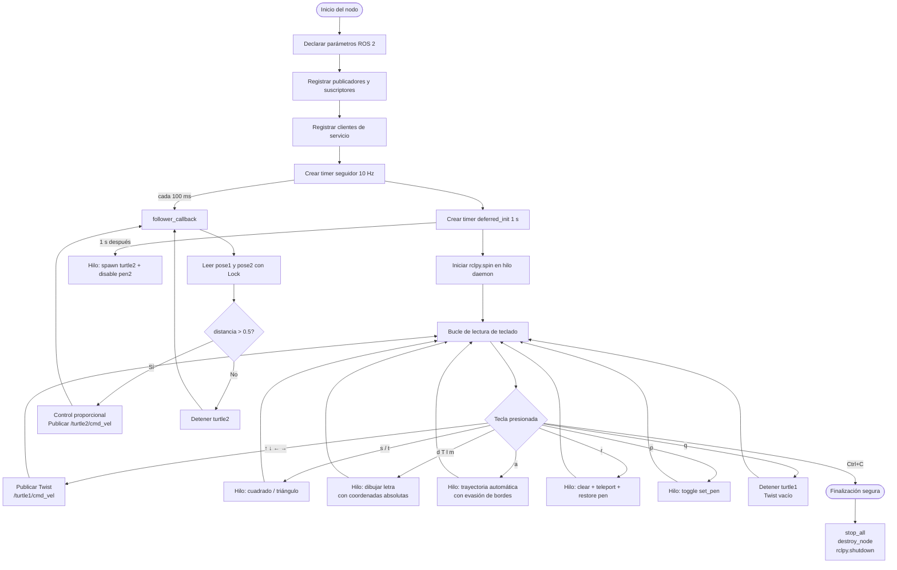

# Laboratorio No. 04 - Robótica 2026-I
## Intro a ROS 2 Jazzy Jalisco — Turtlesim

> **Universidad Nacional de Colombia**
> **Integrantes:** Duvan Tique — Luis Mendoza
> **Repositorio:** https://github.com/labsir-un/Robotica-2026-I-Equipo-3D-Mendoza-Tique/tree/main/Laboratorio%20No.%2004%20-%20Rob%C3%B3tica%20de%20Desarrollo%20ROS%20Jazzy%20y%20Turtlesim
> 

---

## Descripción general

Este laboratorio implementa un nodo ROS 2 en Python que permite controlar la tortuga `turtle1` en el simulador `turtlesim` mediante el teclado, ejecutar trayectorias automáticas, dibujar letras personalizadas y mantener un sistema líder-seguidor con `turtle2`.

El código está organizado en módulos separados siguiendo la filosofía de ROS 2:

| Módulo | Responsabilidad |
|---|---|
| `node.py` | Nodo principal, parámetros, timers |
| `topics.py` | Publicadores, suscriptores, seguidor |
| `services.py` | Clientes de servicio turtlesim |
| `actions.py` | Trayectorias, letras, control manual |
| `keyboard.py` | Lectura de teclado, bucle principal |
| `constants.py` | Constantes compartidas (WIN_MIN, WIN_MAX) |

---

## Requisitos

| Software | Versión |
|---|---|
| Ubuntu | 24.04 LTS |
| ROS 2 | Jazzy Jalisco |
| Python | 3.12+ |
| turtlesim | `ros-jazzy-turtlesim` |

---

## Estructura del repositorio

```
my_turtle_controller/
├── package.xml
├── setup.py
├── setup.cfg
├── resource/
│   └── my_turtle_controller
└── my_turtle_controller/
    ├── __init__.py
    └── turtle_controller/
        ├── __init__.py
        ├── constants.py
        ├── node.py
        ├── topics.py
        ├── services.py
        ├── actions.py
        └── keyboard.py
```

---

## Instalación y ejecución

### 1. Crear el workspace y el paquete

```bash
mkdir -p ~/ros2_ws/src
cd ~/ros2_ws/src
ros2 pkg create --build-type ament_python my_turtle_controller \
    --dependencies rclpy geometry_msgs turtlesim std_srvs
```

### 2. Copiar los archivos del laboratorio

```bash
mkdir ~/ros2_ws/src/my_turtle_controller/my_turtle_controller/turtle_controller
# Copiar todos los módulos a esa carpeta
```

### 3. Compilar

```bash
cd ~/ros2_ws
colcon build --packages-select my_turtle_controller
```

### 4. Cargar el entorno

```bash
source /opt/ros/jazzy/setup.bash
source ~/ros2_ws/install/setup.bash
```

### 5. Ejecutar

**Terminal 1 — Simulador:**
```bash
ros2 run turtlesim turtlesim_node
```

**Terminal 2 — Controlador:**
```bash
ros2 run my_turtle_controller move_turtle
```

**Terminal 3 — Crear turtle2 (sistema líder-seguidor):**
```bash
ros2 service call /spawn turtlesim/srv/Spawn \
    "{x: 8.0, y: 2.0, theta: 0.0, name: 'turtle2'}"
```

---

## Control del teclado

| Tecla | Acción |
|---|---|
| `↑` | Avanzar hacia adelante |
| `↓` | Retroceder |
| `←` | Girar a la izquierda |
| `→` | Girar a la derecha |
| `s` | Dibujar cuadrado |
| `t` | Dibujar triángulo equilátero |
| `r` | Reiniciar posición de turtle1 y limpiar pantalla |
| `p` | Activar / desactivar lápiz |
| `a` | Trayectoria automática con evasión de bordes |
| `q` | Detener turtle1 |
| `d` | Dibujar letra **D** (Duvan) |
| `T` | Dibujar letra **T** (Tique) |
| `l` | Dibujar letra **L** (Luis) |
| `m` | Dibujar letra **M** (Mendoza) |
| `Ctrl+C` | Salir del programa |

---

## Explicación de funciones implementadas

### Control manual

Las flechas del teclado publican directamente un mensaje `geometry_msgs/Twist` en `/turtle1/cmd_vel`. La lectura usa `termios` y `tty` para capturar secuencias de escape ANSI sin librerías externas. Las velocidades se leen desde parámetros ROS 2 modificables en tiempo de ejecución:

```bash
ros2 param set /turtle_controller linear_speed 3.0
ros2 param set /turtle_controller angular_speed 2.0
```

### Trayectorias automáticas

**Cuadrado (`s`):** avanza y gira 90° cuatro veces.

**Triángulo (`t`):** avanza y gira 120° tres veces.

**Trayectoria A (`a`):** corre en hilo daemon. Tiene dos fases:
- **Fase avance:** publica `linear.x = linear_speed` mientras no detecte borde.
- **Fase giro:** cuando `turtle1` se acerca a `border_margin` unidades del borde, entra en un bucle interno que gira hacia el centro hasta que el error angular es menor a 0.10 rad, luego retoma el avance.

### Dibujo de letras personalizadas

Cada letra usa coordenadas absolutas: la tortuga se teletransporta al inicio de cada segmento con el lápiz apagado, enciende el lápiz y avanza la distancia exacta calculada con `math.hypot`. Esto evita acumulación de errores angulares.

| Tecla | Letra | Color | Integrante |
|---|---|---|---|
| `d` | D | Amarillo (255, 200, 0) | Duvan |
| `T` | T | Cian (0, 200, 255) | Tique |
| `l` | L | Rojo claro (255, 100, 100) | Luis |
| `m` | M | Verde (100, 255, 100) | Mendoza |

### Reinicio (`r`)

1. Llama al servicio `/clear` para borrar todos los trazados.
2. Apaga el lápiz de `turtle1`.
3. Teletransporta `turtle1` al centro (5.54, 5.54).
4. Restaura el estado del lápiz al que tenía antes del reinicio.
5. Desactiva el lápiz de `turtle2` por si se había reactivado.

### Sistema líder-seguidor

Al ejecutar el nodo, un timer de 10 Hz corre `follower_callback` que:

1. Lee `pose1` y `pose2` de forma thread-safe (con `threading.Lock`).
2. Calcula distancia y ángulo hacia `turtle1` con `math.atan2`.
3. Aplica control proporcional y publica en `/turtle2/cmd_vel`:

```python
twist.linear.x  = min(kl * distance, 2.0)   # kl = follower_gain_lin
twist.angular.z = ka * angle_error            # ka = follower_gain_ang
```

`turtle2` tiene su lápiz permanentemente desactivado para no dejar trazos.

---

## Arquitectura ROS 2 — Nodos, Tópicos y Servicios

### Nodos activos

```
/turtlesim          ← simulador (turtlesim_node)
/turtle_controller  ← nuestro nodo (move_turtle)
```

### Tópicos

| Tópico | Tipo | Rol del nodo |
|---|---|---|
| `/turtle1/cmd_vel` | `geometry_msgs/Twist` | Publica |
| `/turtle2/cmd_vel` | `geometry_msgs/Twist` | Publica |
| `/turtle1/pose` | `turtlesim/Pose` | Suscribe |
| `/turtle2/pose` | `turtlesim/Pose` | Suscribe |

### Servicios

| Servicio | Tipo | Uso |
|---|---|---|
| `/spawn` | `turtlesim/Spawn` | Crear turtle2 |
| `/clear` | `std_srvs/Empty` | Limpiar pantalla |
| `/turtle1/teleport_absolute` | `turtlesim/TeleportAbsolute` | Reposicionar turtle1 |
| `/turtle1/set_pen` | `turtlesim/SetPen` | Configurar lápiz turtle1 |
| `/turtle2/set_pen` | `turtlesim/SetPen` | Desactivar lápiz turtle2 |

### Parámetros ROS 2

| Parámetro | Valor por defecto | Descripción |
|---|---|---|
| `linear_speed` | 2.0 | Velocidad lineal (m/s) |
| `angular_speed` | 1.5 | Velocidad angular (rad/s) |
| `border_margin` | 1.8 | Margen de borde para trayectoria A |
| `follower_gain_lin` | 1.5 | Ganancia proporcional lineal del seguidor |
| `follower_gain_ang` | 4.0 | Ganancia proporcional angular del seguidor |

---

## Verificación de la arquitectura ROS 2

### `ros2 node list`
Lista los nodos activos. Permite verificar que `/turtlesim` y `/turtle_controller` están corriendo.


### `ros2 topic list`
Muestra todos los tópicos disponibles. Se identifican los canales de velocidad y pose de ambas tortugas.


### `ros2 topic echo /turtle1/pose`
Muestra en tiempo real la posición (x, y, theta) y velocidades de `turtle1`. Útil para depurar el seguidor.


### `ros2 topic info /turtle1/cmd_vel`
Muestra tipo de mensaje, número de publicadores y suscriptores. Confirma que solo `turtle_controller` publica en este tópico.


### `ros2 service list`
Lista todos los servicios disponibles. Se identifican `/spawn`, `/clear`, `/turtle1/set_pen` y `/turtle1/teleport_absolute`.


### `rqt_graph`
Visualiza gráficamente nodos, tópicos y conexiones entre publicadores y suscriptores.


---

## Diagrama de flujo



---

## Decisiones de diseño

- **Herencia múltiple de mixins:** `TurtleController` hereda `TopicsManager`, `ServiceManager` y `ActionsManager`. Cada mixin tiene una responsabilidad única y no depende de los otros directamente.
- **`threading.Event` en servicios:** reemplaza `rclpy.spin_until_future_complete` para evitar el error `Executor is already spinning` al llamar servicios desde hilos secundarios.
- **`threading.Lock` en poses:** evita race conditions entre el hilo de `rclpy.spin` (que escribe poses) y los hilos de trayectoria (que las leen).
- **Parámetros ROS 2:** las velocidades y márgenes son parámetros declarados, no constantes hardcodeadas. Se pueden cambiar en tiempo de ejecución con `ros2 param set`.
- **Inicialización diferida:** el spawn de `turtle2` se hace en un timer de 1 s para garantizar que `rclpy.spin` ya esté activo cuando se llaman los servicios.
- **QoS BEST_EFFORT en pose:** `turtlesim` publica pose con `BEST_EFFORT`; declararlo explícitamente evita warnings de incompatibilidad.

---

## Referencias

1. LabSIR UN. *Intro Linux - Ubuntu 24.04*. https://github.com/labsir-un/01_Rob_2026_I_Intro_Ubuntu_24.04.git
2. LabSIR UN. *Intro ROS 2 Jazzy Jalisco*. https://github.com/labsir-un/02_Rob_2026_I_Intro_ROS2_Jazzy.git
3. LabSIR UN. *Intro Turtlesim con ROS 2 Jazzy*. https://github.com/labsir-un/03_Rob_2026_I_ROS2_Jazzy_Turtlesim.git
4. LabSIR UN. *Arquitectura de funcionamiento de ROS 2*. https://github.com/labsir-un/04_Rob_2026_I_ROS2_Jazzy_Architecture.git
5. Open Robotics. *ROS 2 Jazzy Installation Guide*. https://docs.ros.org/en/jazzy/Installation.html
6. Open Robotics. *Using turtlesim, ros2, and rqt*. https://docs.ros.org/en/jazzy/Tutorials/Beginner-CLI-Tools/Introducing-Turtlesim/Introducing-Turtlesim.html
